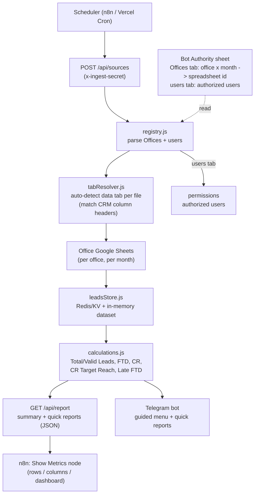
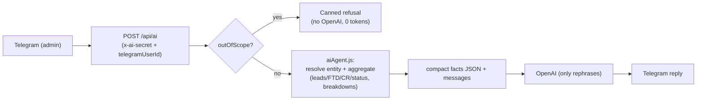

# n8n ingestion (SQL-less)

This folder contains ready-to-import n8n workflows that read the CRM Google
Sheets and store them in the bot's SQL-less dataset (Redis/KV + in-memory). The
Telegram bot — and n8n itself, via the report API — then read from that dataset.

## Working map



## Endpoints (all protected by `INGEST_SECRET`)

- `GET /api/sources` — list discovered sheets (`?includeUsers=1` for the users tab).
- `POST /api/sources` — registry-driven sync: detects each file's data tab and
  stores it; refreshes authorized users. Narrow with `?period=` / `?sourceKey=`.
- `GET /api/report` — dashboard + quick reports as JSON. Query: `type`
  (`all|summary|quick`), `office`, `country`, `agent`, `campaign`, `teamLeader`,
  `status`, `date` (`today|yesterday|thisMonth|lastMonth`) or `start`+`end`,
  `limit`. This is what the dashboard workflow surfaces inside n8n.

## Different tabs per file

Office files do not have to name their data tab `Leads`. During sync,
`tabResolver` lists each file's tabs and picks the one(s) whose header row
matches the CRM columns (`ID`, `Country`, `FTD MAKER`, `Lead Date`, …), so the
correct sheet is read automatically regardless of its name.

## Two ways to set this up — pick one

### Option A — Bot Authority registry (recommended, least n8n work)

Keep a **Bot Authority** spreadsheet whose `Offices` tab maps office × month to
each data spreadsheet ID (and a `users` tab for authorized users). Then n8n does
**not** need any Google Sheets nodes — just one scheduled HTTP call:

```
Schedule → HTTP Request: POST {PUBLIC_APP_URL}/api/sources
           header x-ingest-secret: {INGEST_SECRET}
```

Import `crm-registry-sync.json` for exactly this. The bot reads the registry,
detects each file's data tab, pulls the rows, stores them, and (if
`AUTHORIZE_FROM_REGISTRY` is on) refreshes authorized users from the `users` tab.
Narrow large syncs with `?period=YYYY-MM` or `?sourceKey=...`.

To also see the **metrics, rows, columns and quick reports inside n8n**, import
`crm-dashboard.json`: it syncs, then calls `GET /api/report?type=all` and surfaces
the summary + top agents/countries + status distribution in a Show Metrics node.

Why this is easier when sheets grow: adding "4 sheets per office per month" is
editing a spreadsheet, not editing/redeploying an n8n workflow. The service
account must be shared on the registry **and** on every office sheet it lists.

### Option B — define the sheet IDs in n8n (no registry sheet)

If you prefer to keep the list inside n8n, import `crm-sheets-sync.json` and edit
the **Define Sources** Code node — paste the office/month/spreadsheetId rows
there. n8n then reads each Google Sheet and pushes it to `/api/ingest`. This is
fine for a small, fairly static list; you edit the workflow whenever sheets are
added. The workflow below describes this option.

## Why this architecture

- **Many growing sheets** — 4 new sheets per office every month. Each sheet is a
  *source* identified by a stable `sourceKey` (e.g. `istanbul:2026-05:leads`).
  Adding sheets is data (a new row in the workflow's source list), not code.
- **Small data, no SQL** — rows are kept as JSON per source. The KPI math is
  unchanged: rows are stored exactly as they come from the sheet and the bot runs
  the exact same calculations on them.
- **n8n is the scheduler/ETL only.** It does not compute KPIs; it just ships raw
  rows. All calculation criteria live in the bot so they cannot drift.

## Data flow

```
Schedule → Define Sources → Loop → Read Google Sheet → Aggregate → POST /api/ingest
                                                                       ↓
                                                  store rows (Redis/KV + in-memory)
                                                                       ↓
                                              Telegram bot reads the dataset for reports
```

## Setup

1. Configure the app (Vercel env or `.env.local`):
   - `INGEST_SECRET` — shared secret the workflow sends as `x-ingest-secret`.
   - `KV_REST_API_URL` / `KV_REST_API_TOKEN` (or `UPSTASH_REDIS_REST_URL` /
     `UPSTASH_REDIS_REST_TOKEN`) so the dataset survives serverless cold starts.
     Without KV the dataset lives in memory and is rebuilt on the next sync.

2. In n8n:
   - Import `n8n/crm-sheets-sync.json`.
   - Set environment variables `PUBLIC_APP_URL` and `INGEST_SECRET` in n8n.
   - Attach a Google credential to the **Read Google Sheet** node (a service
     account with read access to the spreadsheets).
   - Edit the **Define Sources** Code node to list every sheet to sync. Each
     entry needs `sourceKey`, `office`, `period`, `category`, `spreadsheetId`,
     `sheetName` and `range`.
   - Activate the workflow.

## Ingest request contract

`POST {PUBLIC_APP_URL}/api/ingest` with header `x-ingest-secret: <INGEST_SECRET>`:

```json
{
  "sourceKey": "istanbul:2026-05:leads",
  "office": "Istanbul",
  "period": "2026-05",
  "category": "leads",
  "spreadsheetId": "...",
  "sheetRange": "A:Y",
  "rows": [ { "ID": "1", "Country": "Turkey", "Lead Date": "11/05/2026", "...": "..." } ]
}
```

Notes:

- `rows` are header-keyed objects (n8n's Google Sheets node output). Alternatively
  send raw `values` (array of arrays); the endpoint converts them using the
  configured column layout.
- Each call **replaces** all stored rows for that `sourceKey`, so re-running the
  workflow is idempotent.
- Column names must match the sheet headers documented in the project README
  (`ID`, `Lead Date`, `FTD DATE`, `FTD MAKER`, `Diffrent Month`, `CR TARGET`,
  `LATE FTD +30 Day`, etc.) so the KPI calculations stay correct.
- Set `LEADS_SOURCE=ingest` to force the bot to use ingested data, or leave it on
  `auto` to use ingested data when present and fall back to Google Sheets.

## AI agent (admin-only Q&A) — `crm-ai-agent.json`

An optional natural-language layer **for admins only**: an admin messages the
bot and asks about a desk, team leader, agent, country or campaign, and gets a
grounded answer built from the same KPIs the dashboard uses.

### How it is token-efficient

The LLM never sees raw rows. The flow is:



- `/api/ai` resolves the question to an **entity** (agent / team leader / desk /
  country / campaign / brand / placement) or an **overview**, then aggregates a
  small, rounded `facts` object (totals, per-country/campaign/agent breakdowns,
  status shares such as no-answer / call-again). Only that compact JSON — never
  the rows — is sent to OpenAI.
- **Out-of-scope** questions (anything not about these reports) are flagged
  server-side and answered with a canned refusal **in the user's language**;
  OpenAI is not called at all.
- A deterministic `draftAnswer` is also returned and used as a fallback if
  OpenAI is unavailable.

### Setup

1. Set `AI_AGENT_SECRET` (or reuse `INGEST_SECRET`), `OPENAI_API_KEY`, and
   optionally `OPENAI_MODEL` (default `gpt-4o-mini`) in the app + n8n env.
2. Make sure the configured admins (`ADMIN_USERS`) are correct — the endpoint
   verifies `telegramUserId` is an admin and refuses everyone else.
3. Use a **dedicated Telegram bot** (a second bot token) for the AI agent. The
   report bot already owns the `/api/telegram` webhook and Telegram allows only
   one receiver per bot, so reusing the same token would break the report bot.
4. Import `crm-ai-agent.json`, select the AI bot's Telegram credential on the
   trigger and the two reply nodes, and activate. (You can swap the raw OpenAI
   HTTP node for n8n's native OpenAI node + credential if you prefer.)

### Request contract

`POST {PUBLIC_APP_URL}/api/ai` with header `x-ai-secret: <AI_AGENT_SECRET>`:

```json
{ "question": "Ali ajanı hangi ülkede iyi?", "telegramUserId": 12345678 }
```

Returns either `{ "outOfScope": true, "refusal": "...", "language": "tr" }` or
`{ "outOfScope": false, "intent": {...}, "facts": {...}, "draftAnswer": "...", "messages": [...] }`.

### What it can answer (question taxonomy)

The agent maps a question to whatever metrics/rows are relevant. Examples:

- **Desk** → which team leaders/teams work in it and how each performs
  (leads, FTD, CR, target reach), strongest/weakest countries & campaigns.
  - "Istanbul masasında hangi takımlar var, performansları nasıl?"
- **Team leader** → their agents ranked, best vs weakest agent, team totals.
  - "Lider 2'nin ajanları nasıl, en zayıf kim?"
- **Agent** → where they are strong vs weak by country/campaign, status
  problems (high no-answer, high call-again with low FTD), CR vs target.
  - "Ahmet hangi ülke/kampanyada iyi, nerede kötü? No-answer'ı yüksek mi?"
- **Country** → top desks/campaigns/agents in that country, totals, CR.
  - "Almanya'da en iyi masa ve kampanya hangisi?"
- **Campaign / brand / placement** → countries/desks/agents driving it.
- **Overview / metric + date** → "Bu ay kaç FTD?", "Dünkü en iyi 5 ajan?".

Other useful patterns it supports: "Which agents have many call-agains but no
FTD?", "Compare Germany vs Turkey CR target reach", "Worst desks by target
reach this month", "Top campaigns by FTD in Spain".
